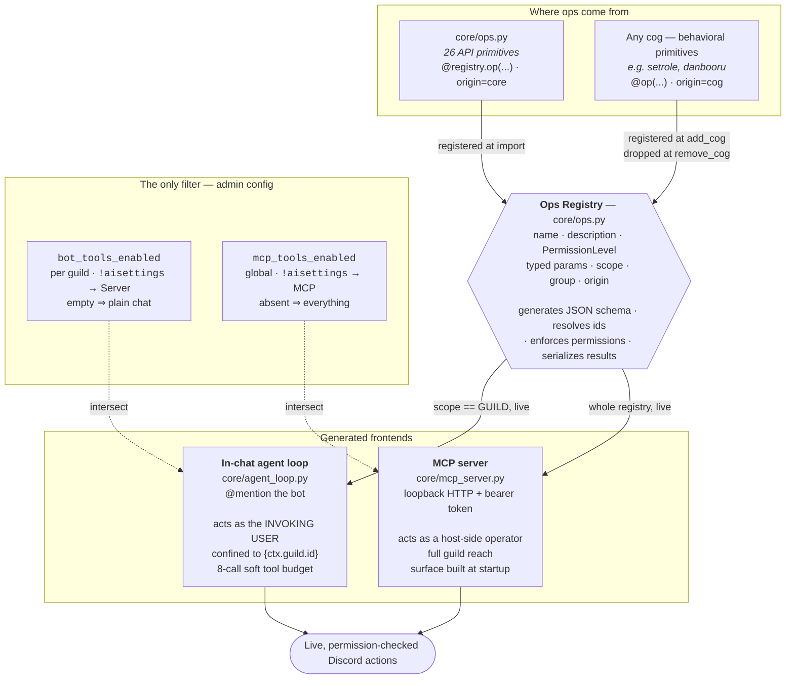
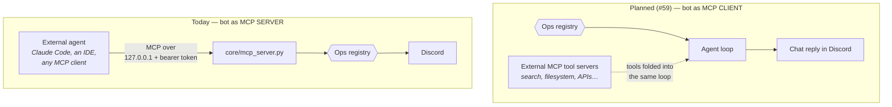

# LiterallyBot

A modular Discord bot built with discord.py that's designed to be a "jack of all trades" — from AI chat to utilities and entertainment.

Its organizing idea: **every Discord action the bot can take is declared exactly once**, in a permission-checked ops registry, and every way of driving the bot is generated from that declaration. Write one op and it becomes an AI tool your members can use in chat, an MCP tool your own agents can call over loopback, and a toggle in the admin panel — no per-frontend plumbing, no duplicated auth check, no hand-maintained tool lists. Cogs can contribute ops too, registering and unregistering with the cog itself.

Also: a boot-fixed cog set with a per-deployment enable/disable switch, a three-scope JSON config system with atomic saves and live external-edit reload, and provider-agnostic AI. Actively developed.

## 🚀 Quick Start

```bash
git clone https://github.com/dudebot/literallybot.git
cd literallybot
./start.sh          # Windows: start.bat
```

It builds the venv, installs dependencies, then asks for your bot token and
pastes-and-goes. Grab one at
[discord.com/developers/applications](https://discord.com/developers/applications)
(**New Application** → **Bot** → **Reset Token**). The token isn't echoed as you
type, and it's saved only after it successfully logs in — so a typo just asks
again instead of leaving you with a broken config file.

Then invite the bot to your server. You're already its superadmin: on a first
run the bot grants that to the application owner automatically, so there's no
`!claimsuper` incantation to discover.

### Installing it somewhere else

Four paths, one precedence chain. The bot resolves its token as
**`DISCORD_TOKEN` env var → saved config → interactive prompt**, and if there's
no token *and* nowhere to prompt, it exits immediately with instructions rather
than hanging a console waiting for input that can't arrive.

| Where | What to do |
|-------|-----------|
| **Linux / macOS** | `./start.sh` and paste the token at the prompt. Saved to `configs/global.json` (mode 0600); later starts need nothing. |
| **Windows** | `start.bat` — same prompt, same one-time paste. Needs [Python 3](https://python.org) with "Add Python to PATH" checked at install. |
| **Game/hosting panel** (Pterodactyl, Pelican, most others) | Add a **`DISCORD_TOKEN` startup variable** in the panel's Startup tab, then run `./start.sh`. There's no terminal to prompt on a panel, so the env var *is* the setup — and the bot telling you exactly that when the variable is missing is the intended behavior, not an error to work around. |
| **Docker / systemd** | Pass the token as an environment variable: `docker run -e DISCORD_TOKEN=... `, or `Environment="DISCORD_TOKEN=..."` (or an `EnvironmentFile=` pointing at a 0600 file) in the unit. |

An env-supplied token is **never written to disk** — where you set it is where
it stays, so rotating it in your panel or unit file is the whole operation.

> **`.env` is deprecated.** It's still loaded if present, so existing
> deployments keep working untouched, but it's no longer part of setup: use the
> prompt or the `DISCORD_TOKEN` environment variable. A real environment
> variable wins over a stale `.env` entry.

## ✨ Key Features

- **🧭 One Ops Layer, Many Frontends** — 26 permission-checked Discord primitives declared once, driving the in-chat agent, an MCP server, and the admin panel alike (see [Architecture](#️-architecture-one-ops-layer-many-frontends))
- **🧩 Modular Cog System** — features are self-contained cogs; disable them globally without deleting them (binds at restart); cogs can register their own ops
- **🤖 AI Integration** — provider-agnostic chat (xAI, OpenAI, Anthropic, local Ollama) with memory, personality, and an optional agentic mode that performs real Discord actions
- **🔌 MCP Server** — drive your bot from Claude Code or any MCP client over loopback HTTP with bearer auth
- **⚙️ Smart Configuration** — per-server, per-user, and global JSON settings with write buffering, atomic saves, and live reload on external edits
- **🎲 Utilities & Fun** — dice rolling, random choices, reminders with snooze buttons, auto-responses, per-guild media libraries, reaction roles
- **🛠️ Developer Friendly** — comprehensive logging, error routing to Discord channels, one-command restart

## 🏛️ Architecture: one ops layer, many frontends

The interesting thing about this bot is not any one feature — it is that
**every atomic Discord action is defined exactly once**, in a registry, with
its permission requirement and its typed parameters declared alongside it.
Everything that can drive the bot is *generated* from that one declaration.

Add an op, and it simultaneously becomes an AI tool the in-chat agent can
call, an MCP tool an external agent can call, and a row in the admin panel —
with no per-frontend plumbing, no duplicated permission check, and no
hand-maintained tool list anywhere.

Two kinds of op live in one registry: **API primitives** — raw, one-to-one
Discord actions declared in `core/ops.py` — and **behavioral primitives** —
capabilities a cog registers that carry the bot's own intelligence (set up an
emoji role toggle, run a policy-filtered image search). Same declaration
shape, same calling convention, same permission gates; only their origin
differs, and the panel shows them as separate sections.



**What each piece buys you:**

- **The registry is the only source of truth.** There is no code-level "which
  ops are agent tools" list. The in-guild agent's universe is *derived*: every
  op whose `scope` is `GUILD`, queried live. Add a guild-scoped op and it is
  offerable to the agent the moment it registers.
- **Cogs contribute ops.** A cog decorates a method with `@op(...)`; the ops
  register when the cog loads and unregister when it unloads, all-or-none, so
  a cog never runs with half its ops missing. `origin` is stamped by the
  registration *path*, never claimed by a decorator argument — a cog cannot
  pass itself off as an API primitive.
- **Config is an exposure filter, not the authorization.** Turning an op on in
  the panel only decides whether it's *offered*. Every call still passes the
  op's own `PermissionLevel` gate against the real invoking user, before any
  Discord id is even resolved.
- **`scope` is the safety boundary.** Guild-scoped ops are the only ones a
  guild-confined, user-actored agent loop can be offered; DM and global ops
  (`send_dm`, `list_guilds`) never appear in a guild's agent surface at all.

### The MCP story

Today the bot is an MCP **server**: your own agents drive your Discord bot
through the same permission-checked ops a member's `@mention` would.



The two directions are independent and compose: an external agent can drive
the bot while the bot's own in-chat agent reaches out to external tools.

## 🧭 Command Surface Philosophy

Administrative surfaces are **single-invoker interactive panels**, gated by the
bot's own admin concept (`is_admin` / `is_superadmin`) rather than by the
invoker's Discord permissions — the bot's admins do not necessarily hold
Discord's Administrator bit, and gating on it caused a real lockout.

Each panel exists twice on purpose: a hidden prefix command (`!aisettings`,
`!autoresponse`, `!media`, `!cogs`, `!config`) and an **ephemeral slash twin**
(`/aisettings`, `/autoresponse`, `/media`, `/cogs`, `/config`). Ephemeral is a
property of an interaction response, so only the slash form can keep a guild's
model/provider/tool configuration from being read by everyone in the channel.
Neither form uses `app_commands.default_permissions` — the check is the bot's
own gate, evaluated at invoke time, and a non-admin who runs one gets an
ephemeral refusal.

Beyond the panels, the public surface is small: `/help` and `/role`. `/help`
and `!help` show each invoker exactly the commands they can actually run, and
superadmin-only controls are *omitted* from a panel's render for non-superadmins
rather than merely disabled.

## 📋 Everyday Commands

- `/help` or `!help` — one embed of the bot's commands, grouped by cog, filtered to what you can actually run
- **Chat with the AI** — @mention the bot or reply to one of its messages (no command needed; guild channels only)
- `!dice <NdX>` — roll dice, e.g. `!dice 2d20`
- `!random <choices>` / `!order <choices>` — pick or shuffle
- `!remindme <duration> <message>` — e.g. `!remindme 10 minutes Check the oven`, `!remindme 1d12h Ship it` (aliases: `!r`, `!reminder`); deliveries come with snooze buttons scaled to the original duration
- `!should <question>` — yes/no oracle; answers most interrogatives (`!is`, `!are`, `!will`, `!shall`, …)
- `!ping` / `!info` — latency and bot info
- `!<name>` — post any file from this server's media library (see Media Libraries below)
- **Reaction roles** — react to a configured message to toggle a role; admins manage mappings with `/role add`, `/role delete`, `/role sync`

## 🤖 AI Chat

The AI layer lives in `core/llm/` (provider-agnostic client built on
[pydantic-ai](https://ai.pydantic.dev/)) and supports multiple providers behind
one interface: xAI (Grok), OpenAI, Anthropic (Claude), and any local
OpenAI-compatible server such as [Ollama](https://ollama.com/).

**Talking to it:** @mention the bot or reply to its messages. Chat is
guild-only, has a per-guild kill switch, and is rate-limited by a
nested-window cooldown ladder — all tunable from the panel.

**Configuring it:** `!aisettings` (admin-only, hidden from `/help` for
non-admins) opens the AI settings panel — pick provider/model, set API keys,
edit the personality, manage per-tool agentic allowlists, tune cooldowns,
and (superadmin) add/remove providers and models. Superadmin-only controls
are omitted from the panel entirely for non-superadmins.

**API keys** live in global config (`configs/global.json`) or environment
variables — set them from the panel, or directly:
```json
"XAI_API_KEY": "xai-XXXX",
"OPENAI_API_KEY": "sk-XXXX",
"ANTHROPIC_API_KEY": "sk-ant-XXXX"
```
Provider/model lists live under `ai_providers` in global config and are
managed at runtime through the panel — no code change to add a model.

**Local models (Ollama):** point a provider at a local server with
`"base_url": "http://localhost:11434/v1"` and `"requires_api_key": false` in its
`ai_providers` entry. Reasoning models that would otherwise spend their whole
token budget "thinking" can be tamed with `"reasoning_effort": "none"` per model.

### Agentic AI (experimental)

When enabled, the AI can **perform real Discord actions** — send/edit messages,
add reactions, search history, manage roles and emojis, plus anything a loaded
cog contributes — instead of only describing them. It runs a tool-calling loop
over the shared **ops registry** (`core/ops.py`), acting as the **invoking
user** (never the bot), confined to the current guild, with mentions suppressed
and a per-run tool-call budget.

Agentic mode is per-tool: each guild has a `bot_tools_enabled` allowlist
(default empty, so chat stays plain chat and nothing changes), managed from the
`!aisettings` → Server config tab by any bot admin. The *universe* that
allowlist draws from isn't a hand-maintained list — it's every registered op
whose `scope` is `GUILD`, queried live, which is why a guild admin choosing
from it can't escalate past their own guild. Ops belonging to an unloaded cog
stay in the stored allowlist and simply drop out of the effective set until the
cog comes back. See `docs/security.md` for the full model.

## 🎬 Media Libraries

Each guild gets its own media library under `media/<guild_id>/` (runtime
data, not in git) — libraries never bleed across guilds. Any member posts a
clip with `!<name>`; admins manage the library through the `!media` panel —
add from a URL (YouTube or direct file link, with optional trim), delete,
and browse the listing with file sizes.

## 🛡️ Administration

**Admin hierarchy** (the bot's own concept, separate from Discord permissions):
- `!claimsuper` — become a bot superadmin (first time only)
- `!addsuperadmin @user` / `!removesuperadmin @user` — manage superadmins
- `!claimadmin` / `!addadmin @user` / `!removeadmin @user` — manage per-server bot admins
- `!listadmins` — show this server's bot admins and the global superadmins

**Panels** (single-invoker interactive Views):
- `!aisettings` — AI provider/model/keys/personality/agentic tools/cooldowns/MCP (admin; superadmin tabs hidden from admins)
- `!autoresponse` — per-guild trigger→response entries, uniform-random response pick, automod-style deletion (admin)
- `!media` — this guild's media library (admin)
- `!cogs` — enable/disable cogs bot-wide, plus a restart button (superadmin)
- `!config` — global-config editor (superadmin)

**Cog & code management** (superadmin) — the cog set is fixed at boot; these edit
config and take effect on the next restart:
- `!disable <cog>` / `!enable <cog>` — global disabled_cogs switch: carry a cog on disk without running it
- `!list_cogs` — the optional cogs on disk, disabled ones marked
- `!sync` — sync slash commands
- `!restart` (alias `!kys`) — graceful shutdown (systemd restarts it)

### Error Logging (optional)
- `!errorlog setchannel #channel` — set the error channel for this guild
- `!errorlog setglobal #channel` — set the global error channel (superadmin)
- `!errorlog setcategory` / `!errorlog setseverity` — category/severity routing
- `!errorlog status` / `!errorlog disable` / `!errorlog ratelimit` — inspect, disable, tune

Errors are rate-limited globally to avoid spam. See `docs/error-handling.md`.

## 🔧 Optional Integrations

### Image Search (Danbooru)
`!danbooru <tags>` (alias `!db`). Keys go in `configs/global.json`
(`DANBOORU_API_KEY`, `DANBOORU_LOGIN`), or as environment variables of the same
names:
```bash
DANBOORU_API_KEY=your_danbooru_key
DANBOORU_LOGIN=your_danbooru_username
```

## 🔌 MCP Ops Server

`core/mcp_server.py` exposes the bot's ops registry (`core/ops.py` —
permission-checked, typed Discord actions like `send_message`,
`search_history`, `send_dm`, `create_role`) over
[MCP](https://modelcontextprotocol.io/) so an external agent can drive the bot
the same way an in-bot command would, without either frontend re-implementing
Discord plumbing or permission logic.

**This is OFF by default.** There is exactly one way to run it: in-process
with the bot. `bot.py` starts it automatically after ready when the
`mcp_ops_enabled` global config bool is true (toggle in `!aisettings` → MCP
tab; binds on restart), and the tools act through the live bot. When the flag
is unset/false, running the normal bot never starts it. (A standalone runner
existed until 2026-08; it logged a *second* Discord client into the same bot
account and could not see ops registered by cogs, so it was deleted rather
than fixed.)

**Security model (all gates fail closed):**
- **Off by default** — refuses to start unless the `mcp_ops_enabled` global
  config boolean is true.
- **Auth required** — every request must send `Authorization: Bearer <token>`;
  requests without a matching token get a `401` (compared constant-time with
  `hmac.compare_digest`). The token is read config-first: the `mcp_ops_token`
  global config key, else the `MCP_OPS_TOKEN` env var. If neither is set when
  an operator enables the server, one is generated
  (`secrets.token_urlsafe(32)`) and stored in `configs/global.json` — the
  server is never unauthenticated, and the value is never logged.
- **Loopback only** — binds to `127.0.0.1`, no host override. Every tool
  call is a live, authenticated Discord bot action; do not tunnel this port
  off-host casually.
- `send_message` always sends with `allowed_mentions` = none (no pings);
  `search_history` clamps `limit` to 200.
- **Full guild reach by design** — tools act as raw primitives: every guild
  the bot account is in is addressable. DMs flow through the dedicated
  `send_dm`/`read_dms`/`fetch_dms` ops, never through id-based channel calls.
  Access control belongs upstream in the MCP caller; the only guild-confined
  surface is the in-bot agent loop (pinned to its invoking guild).
- **Accepted risk:** `actor_id` is caller-supplied and not bound to the
  bearer token, so any token-holder can act as any user id for permission
  purposes. Fine for localhost self-use; add real actor auth before any
  wider exposure.

**Run it:** turn it on, then restart the bot.

```bash
# enable the server in global config (or via !aisettings -> MCP tab):
python3 -c "import json;p='configs/global.json';d=json.load(open(p));d['mcp_ops_enabled']=True;json.dump(d,open(p,'w'),indent=4)"
# optional — set your own token/port instead of the generated ones:
#   global config `mcp_ops_token` / `mcp_ops_port`, or MCP_OPS_TOKEN / MCP_OPS_PORT
```

On the next start the bot serves streamable-HTTP MCP at
`http://127.0.0.1:<port>/mcp`. The port resolves config-first: the
`mcp_ops_port` global config key, else the `MCP_OPS_PORT` env var, else the
default **8765** — so a deployment running more than one bot gives each its own
port in config, and the URL below must match whatever *that* deployment
resolved. If no token was configured, the bot generates one into
`configs/global.json` under `mcp_ops_token` and logs *that it did so* (never
the value) — read it out of that file to connect a client.

**Connect to it** (e.g. from an MCP-capable client config — substitute your own
port if you set `mcp_ops_port`):
```json
{
  "mcpServers": {
    "literallybot-ops": {
      "url": "http://127.0.0.1:8765/mcp",
      "headers": {
        "Authorization": "Bearer <your mcp_ops_token value>"
      }
    }
  }
}
```

**Exposed tools:** by default the full ops registry, queried live when the
server starts — so ops a cog registered are included too. The 26 API
primitives, by group:

| Group | Ops |
|-------|-----|
| **Messaging** | `send_message`, `edit_message`, `delete_message`, `add_reaction`, `remove_reaction`, `search_history`, `pin_message`, `create_thread` |
| **Roles** | `add_role`, `remove_role`, `list_roles`, `list_role_members`, `create_role`, `edit_role`, `delete_role` |
| **Emojis** | `list_emojis`, `create_emoji`, `edit_emoji`, `delete_emoji` |
| **Guild info** | `list_channels`, `list_members`, `list_channel_overwrites` |
| **Direct messages** | `send_dm`, `read_dms`, `fetch_dms` |
| **Guild** | `list_guilds` |

Loaded cogs add their own behavioral primitives on top (e.g.
`add_emoji_role_toggle` and `sync_emoji_role_toggles` from `setrole`,
`search_danbooru` from `danbooru`), rendered in the panel under their own
groups and visibly separated from the API primitives.

The served subset is trimmable at runtime via the `mcp_tools_enabled` global
config list, managed from the `!aisettings` → MCP tab — what the panel shows is
what gets served. The tool surface is built once per bot start: allowlist edits
and newly loaded cog ops bind on the next restart (MCP's `tools/list_changed`
notification is not reliably deliverable to live streamable-HTTP sessions on
mcp 1.x).

Exact per-tool schemas are served live via MCP `tools/list`; offline, run
`python3 -m core.ops` to print the full ops registry.

`actor_id` is the Discord user id the call is made on behalf of — the
registry runs the same permission check it would for an in-bot command,
against live bot config via `core.utils.is_admin`/`is_superadmin`.

## 🏗️ Development & Extension

### Creating Custom Cogs
Add new features by creating cogs in `cogs/optional/`:

```python
# cogs/optional/my_feature.py
from discord.ext import commands

class MyFeature(commands.Cog):
    def __init__(self, bot):
        self.bot = bot

    @commands.command()
    async def my_command(self, ctx):
        # Access config system
        setting = self.bot.config.get(ctx, "my_setting", "default")
        await ctx.send(f"Setting: {setting}")

async def setup(bot):
    await bot.add_cog(MyFeature(bot))
```

Restart the bot and it loads automatically (anything in `cogs/optional/` not
listed in `disabled_cogs`), showing up in `/help` grouped under its cog.

### Giving a Cog an Op

Any cog can contribute to the ops registry, which makes its capability
available to the in-chat agent, the MCP server, and the admin panel at once.
Factor the logic into a plain service method, then let both the command and the
op call it:

```python
from core.ops import OpParam, OpScope, ParamKind, PermissionLevel, op

class MyFeature(commands.Cog):
    async def _do_thing(self, guild, target: str) -> dict:
        """Service function: plain objects in, plain data out. No Interaction,
        no ctx.send — the caller presents the outcome."""
        ...
        return {"status": "ok", "target": target}

    @commands.command()
    async def thing(self, ctx, target: str):
        result = await self._do_thing(ctx.guild, target)
        await ctx.send(f"Done: {result['status']}")

    @op(
        "do_thing",
        "Does the thing to a target and reports the resulting status.",
        PermissionLevel.ADMIN,
        params=[OpParam("target", ParamKind.STRING, "What to act on.")],
        scope=OpScope.GUILD,
        group="integrations",
    )
    async def op_do_thing(self, ctx, target: str) -> dict:
        return await self._do_thing(ctx.guild, target)
```

The ops register when the cog loads and unregister when it unloads. A batch is
all-or-none, so a malformed op means zero ops registered rather than half — and
the cog is ejected rather than running with its ops silently missing. See
`docs/cog-development.md` →
"Registering ops from a cog" for the full contract, and `cogs/optional/setrole.py`
for a live example.

### Config Quick Reference
LiterallyBot's config helper is available as `self.bot.config` in every cog:

```python
# Per-guild (default scope)
prefix = self.bot.config.get(ctx, "prefix", "!")
self.bot.config.set(ctx, "prefix", "?")

# Per-user
timezone = self.bot.config.get_user(ctx, "timezone", "UTC")
self.bot.config.set_user(ctx, "timezone", "UTC")

# Global (bot-wide)
superadmins = self.bot.config.get_global("superadmins", [])
self.bot.config.set_global("maintenance_mode", True)
```

Lists are just Python lists — get, mutate, then `set` the updated list. Call
`self.bot.config.flush()` before shutdown if you need to force writes
immediately.

### Documentation
- `docs/cog-development.md` — building cogs end-to-end
- `docs/config-system.md` — config API, patterns, and the config Key Registry
- `docs/error-handling.md` — how errors flow and how to handle them
- `docs/security.md` — permission model and the agentic/ops execution path
- `docs/agent-automation.md` — role-gated DM automation pattern for scheduled agents
- `docs/decision-records.md` — durable architecture decision records

### Production Deployment
For Linux servers, run `sudo ./scripts/install_service.sh [service_name]`
(interactive systemd installer — detects the repo directory and its venv), or
start from the unit template in `scripts/literallybot.service.example`.

## Contributing

Contributions are welcome! Please open an issue or submit a pull request for any changes or improvements.

## License

This project is released under the [MIT License](LICENSE).
