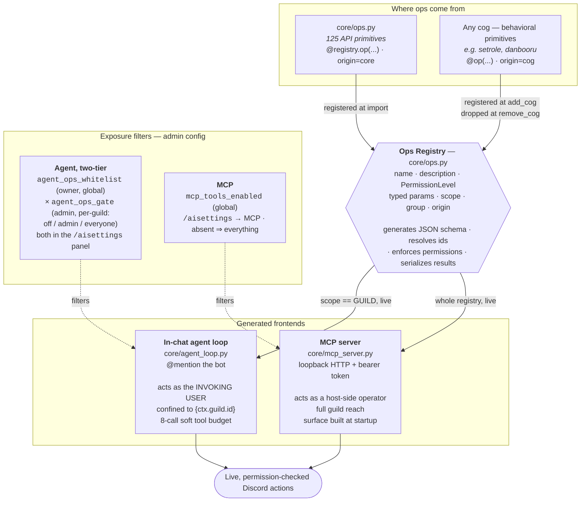
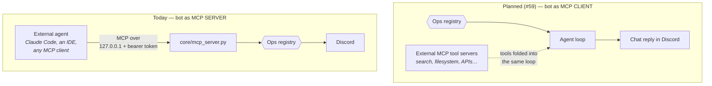

# LiterallyBot

A modular Discord bot built with discord.py — AI chat, moderation, utilities, and entertainment in one "jack of all trades."

Its organizing idea: **every Discord action the bot can take is declared exactly once**, in a permission-checked ops registry, and every way of driving the bot is generated from that declaration. Write one op and it is simultaneously an AI tool your members can invoke in chat, an MCP tool your own agents can call over loopback, and a togglable row in the admin panel — no per-frontend plumbing, no duplicated auth check, no hand-maintained tool lists. Cogs contribute ops too, registering and unregistering with the cog itself. Around that sit a boot-fixed cog set with a per-deployment enable/disable switch, a three-scope JSON config system, and provider-agnostic AI. Actively developed.

## 🚀 Quick Start

```bash
git clone https://github.com/dudebot/literallybot.git
cd literallybot
./start.sh          # Windows: start.bat
```

It builds the venv, installs dependencies, then asks for your bot token and
pastes-and-goes. Grab one at
[discord.com/developers/applications](https://discord.com/developers/applications)
(**New Application** → **Bot** → **Reset Token**). The token isn't echoed as you
type, and it's saved only after it successfully logs in — so a typo just asks
again instead of leaving you with a broken config file.

Then invite the bot to your server. You're already its superadmin: on a first
run the bot grants that to the application owner automatically, so there's no
`!claimsuper` incantation to discover.

### Installing it somewhere else

Four paths, one precedence chain. The bot resolves its token as
**`DISCORD_TOKEN` env var → saved config → interactive prompt**, and if there's
no token *and* nowhere to prompt, it exits immediately with instructions rather
than hanging a console waiting for input that can't arrive.

| Where | What to do |
|-------|-----------|
| **Linux / macOS** | `./start.sh` and paste the token at the prompt. Saved to `configs/global.json` (mode 0600); later starts need nothing. |
| **Windows** | `start.bat` — same prompt, same one-time paste. Needs [Python 3](https://python.org) with "Add Python to PATH" checked at install. |
| **Game/hosting panel** (Pterodactyl, Pelican, most others) | Add a **`DISCORD_TOKEN` startup variable** in the panel's Startup tab, then run `./start.sh`. There's no terminal to prompt on a panel, so the env var *is* the setup — and the bot telling you exactly that when the variable is missing is the intended behavior, not an error to work around. |
| **Docker / systemd** | Pass the token as an environment variable: `docker run -e DISCORD_TOKEN=... `, or `Environment="DISCORD_TOKEN=..."` (or an `EnvironmentFile=` pointing at a 0600 file) in the unit. |

An env-supplied token is **never written to disk** — where you set it is where
it stays, so rotating it in your panel or unit file is the whole operation.

> **`.env` is deprecated.** It's still loaded if present, so existing
> deployments keep working untouched, but it's no longer part of setup: use the
> prompt or the `DISCORD_TOKEN` environment variable. A real environment
> variable wins over a stale `.env` entry.

## ✨ Key Features

- **🧭 One Ops Layer, Many Frontends** — 125 permission-checked Discord primitives declared once, driving the in-chat AI agent, an MCP server, and the admin panel alike (see [Architecture](#️-architecture-one-ops-layer-many-frontends))
- **🤖 AI Chat + Agent** — provider-agnostic chat (xAI, OpenAI, Anthropic, local Ollama) with memory and personality, plus an optional agentic mode that performs real Discord actions under a two-tier permission model
- **🧩 Modular Cogs** — self-contained features; disable any globally without deleting it (binds at restart); cogs can register their own ops
- **🔌 MCP Server** — drive your bot from Claude Code or any MCP client over loopback HTTP with bearer auth
- **⚙️ Smart Config** — per-server, per-user, and global JSON settings with write buffering, atomic saves, and live reload on external edits
- **🎲 Utilities & Fun** — dice, random picks, reminders with snooze buttons, auto-responses, per-guild media libraries, reaction roles
- **🛠️ Developer Friendly** — comprehensive logging, error routing to Discord channels, one-command restart

## 🏛️ Architecture: one ops layer, many frontends

**Every atomic Discord action is defined exactly once**, in a registry, with
its permission floor and typed parameters declared alongside it. Everything that
drives the bot — the in-chat AI agent, the MCP server, the admin panel — is
*generated* from that one declaration, with no per-frontend plumbing, no
duplicated permission check, and no hand-maintained tool list anywhere.

Two kinds of op share the registry: **API primitives** — raw, one-to-one Discord
actions declared inline in `core/ops.py` — and **behavioral primitives** —
capabilities a cog registers that carry the bot's own intelligence (set up an
emoji role toggle, run a policy-filtered image search). Same declaration shape,
same calling convention, same permission gates; only their `origin` differs
(stamped by the registration *path*, so a cog can't pass itself off as core),
and the panel shows them as separate sections. Cog ops register when the cog
loads and unregister when it unloads, all-or-none — a cog never runs with half
its ops missing.

**The rest of the bot are cogs, leaves of this tree.** `cogs/core/` is the
recovery surface (the commands that turn things back on) and is never
disableable; everything else lives in `cogs/optional/` and can be switched off
per deployment. **The cog set is fixed at boot** — there is no live
load/unload/reload; a restart binds a code change, a `disabled_cogs` edit, and
newly registered ops alike.



**Three independent gates decide what the agent will do — and they compose:**

1. **Owner whitelist** (`agent_ops_whitelist`, global) — the bot owner opts each
   op into the agent surface. An op that's off here never reaches any guild's
   agent or panel; this is the context-budget ceiling, since every exposed op
   costs prompt tokens.
2. **Per-guild gate** (`agent_ops_gate`, set by each server's admins) — a
   whitelisted op is set **off / admin / everyone** per guild. "off" hides it;
   "admin" restricts agent use to bot admins; "everyone" opens it to any member
   (still bounded by gate 3). Both tiers live in the `/aisettings` panel.
3. **The op's own `PermissionLevel` floor** — enforced at call time against the
   *real invoking user*, before any Discord id is resolved. The per-guild gate
   can widen exposure but never below what the op itself demands, so an
   "everyone" gate can't hand a member a SUPERADMIN-only op.

`scope` is the outer safety boundary: the guild-confined, user-actored agent
loop is only ever offered `GUILD`-scoped ops — DM and global ops (`send_dm`,
`list_guilds`) never appear in a guild's agent surface at all. The MCP surface
is deliberately *not* governed by the per-guild gate — a host-side operator sees
the whole registry, filtered only by `mcp_tools_enabled`.

### The MCP story

Today the bot is an MCP **server**: your own agents drive your Discord bot
through the same permission-checked ops a member's `@mention` would.



The two directions are independent and compose: an external agent can drive
the bot while the bot's own in-chat agent reaches out to external tools.

## 🧭 Command Surface Philosophy

Administrative surfaces are **single-invoker interactive panels**, gated by the
bot's own admin concept (`is_admin` / `is_superadmin`) rather than by the
invoker's Discord permissions — the bot's admins do not necessarily hold
Discord's Administrator bit, and gating on it caused a real lockout.

Each panel exists twice: a hidden prefix command (`!aisettings`, `!autoresponse`,
`!media`, `!cogs`, `!config`) and an **ephemeral slash twin** (`/aisettings`, …).
Ephemeral is a property of an interaction response, so only the slash form keeps
a guild's configuration from being read by everyone in the channel. Neither uses
`app_commands.default_permissions` — the check is the bot's own gate at invoke
time, and a non-admin gets an ephemeral refusal. Superadmin-only controls are
*omitted* from a panel's render for non-superadmins rather than merely disabled.

Beyond the panels, the public surface is deliberately small — `/help` and
`/role` — and `/help`/`!help` show each invoker exactly the commands they can run.

## 📋 Everyday Commands

- `/help` or `!help` — one embed of the bot's commands, grouped by cog, filtered to what you can actually run
- **Chat with the AI** — @mention the bot or reply to one of its messages (no command needed; guild channels only)
- `!gpt <question>` — same AI chat as a mention, when you'd rather type a command (guild-only)
- `!dice <NdX>` — roll dice, e.g. `!dice 2d20`
- `!random <choices>` / `!order <choices>` — pick or shuffle
- `!remindme <duration> <message>` — e.g. `!remindme 10 minutes Check the oven`, `!remindme 1d12h Ship it` (aliases: `!r`, `!reminder`); deliveries come with snooze buttons scaled to the original duration
- `!should <question>` — yes/no oracle; answers most interrogatives (`!is`, `!are`, `!will`, `!shall`, …)
- `!ping` / `!info` — latency and bot info
- `!<name>` — post any file from this server's media library (see Media Libraries below)
- **Reaction roles** — react to a configured message to toggle a role; admins manage mappings with `/role add`, `/role delete`, `/role sync`

## 🤖 AI Chat

The AI layer lives in `core/llm/` (provider-agnostic client built on
[pydantic-ai](https://ai.pydantic.dev/)) and supports multiple providers behind
one interface: xAI (Grok), OpenAI, Anthropic (Claude), and any local
OpenAI-compatible server such as [Ollama](https://ollama.com/).

**Talking to it:** @mention the bot, reply to its messages, or use `!gpt`. Chat
is guild-only, has a per-guild kill switch, and is rate-limited by a
nested-window cooldown ladder.

**Configuring it:** `/aisettings` (or hidden `!aisettings`; admin-only) opens
the AI settings panel — pick provider/model, set API keys, edit the personality,
govern the agent's per-op gates, and (superadmin) add/remove providers and
models, each with a price bracket that sets its rate-limit tier. The cooldown
ladder has no panel surface — it's hand-edited global config
(`cooldown_tier_bases` / `cooldown_windows`). Superadmin-only controls are
omitted from the panel entirely for non-superadmins.

**API keys** live in global config (`configs/global.json`) or environment
variables — set them from the panel, or directly:
```json
"XAI_API_KEY": "xai-XXXX",
"OPENAI_API_KEY": "sk-XXXX",
"ANTHROPIC_API_KEY": "sk-ant-XXXX"
```
Provider/model lists live under `ai_providers` in global config and are
managed at runtime through the panel — no code change to add a model.

**Local models (Ollama):** point a provider at a local server with
`"base_url": "http://localhost:11434/v1"` and `"requires_api_key": false` in its
`ai_providers` entry. Reasoning models that would otherwise spend their whole
token budget "thinking" can be tamed with `"reasoning_effort": "none"` per model.

### Agentic AI (experimental)

When enabled, the AI can **perform real Discord actions** — spanning the full
125-op registry: messaging, channels, roles, members, moderation, threads,
voice, events, emoji/stickers, invites, webhooks, automod, and DMs — plus
anything a loaded cog contributes, instead of only describing them. It runs a
tool-calling loop over the shared **ops registry** (`core/ops.py`), acting as
the **invoking user** (never the bot), confined to the current guild, with
mentions suppressed and a per-run tool-call budget.

Access is the two-tier model from [Architecture](#️-architecture-one-ops-layer-many-frontends):
the bot owner whitelists which ops the agent may *ever* see (`agent_ops_whitelist`,
global), and each server's admins set every whitelisted op to **off / admin /
everyone** for their guild (`agent_ops_gate`) — both from the `/aisettings`
panel. Nothing is on by default, so plain chat stays plain chat until someone
opts ops in. Every call still passes the op's own `PermissionLevel` floor
against the real user. See `docs/security.md` for the full model.

## 🎬 Media Libraries

Each guild gets its own media library under `media/<guild_id>/` (runtime
data, not in git) — libraries never bleed across guilds. Any member posts a
clip with `!<name>`; admins manage the library through the `!media` panel —
add from a URL (YouTube or direct file link, with optional trim), delete,
and browse the listing with file sizes.

## 🛡️ Administration

**Admin hierarchy** (the bot's own concept, separate from Discord permissions):
- `!claimsuper` — become a bot superadmin (first time only)
- `!addsuperadmin @user` / `!removesuperadmin @user` — manage superadmins
- `!claimadmin` / `!addadmin @user` / `!removeadmin @user` — manage per-server bot admins
- `!listadmins` — show this server's bot admins and the global superadmins

**Panels** (single-invoker interactive Views):
- `!aisettings` — AI provider/model/keys/personality/agentic tools/MCP (admin; superadmin tabs hidden from admins)
- `!autoresponse` — per-guild trigger→response entries, uniform-random response pick, automod-style deletion (admin)
- `!media` — this guild's media library (admin)
- `!cogs` — enable/disable cogs bot-wide, plus a restart button (superadmin)
- `!config` — global-config editor (superadmin)

**Cog & code management** (superadmin) — the cog set is fixed at boot; these edit
config and take effect on the next restart:
- `!disable <cog>` / `!enable <cog>` — global disabled_cogs switch: carry a cog on disk without running it
- `!list_cogs` — the optional cogs on disk, disabled ones marked
- `!sync` — sync slash commands
- `!restart` (alias `!kys`) — graceful shutdown (systemd restarts it)

### Error Logging (optional)
- `!errorlog setchannel #channel` — set the error channel for this guild
- `!errorlog setglobal #channel` — set the global error channel (superadmin)
- `!errorlog setcategory` / `!errorlog setseverity` — category/severity routing
- `!errorlog status` / `!errorlog disable` / `!errorlog ratelimit` — inspect, disable, tune

Errors are rate-limited globally to avoid spam. See `docs/error-handling.md`.

## 🔧 Optional Integrations

### Image Search (Danbooru)
`!danbooru <tags>` (alias `!db`). Keys go in `configs/global.json`
(`DANBOORU_API_KEY`, `DANBOORU_LOGIN`), or as environment variables of the same
names:
```bash
DANBOORU_API_KEY=your_danbooru_key
DANBOORU_LOGIN=your_danbooru_username
```

## 🔌 MCP Ops Server

`core/mcp_server.py` exposes the ops registry over
[MCP](https://modelcontextprotocol.io/) so an external agent (Claude Code, an
IDE, any MCP client) drives the bot the same way an in-bot command would.

**Off by default, and in-process only.** `bot.py` starts it after ready when the
`mcp_ops_enabled` global config bool is true (toggle in `/aisettings` → MCP tab;
binds on restart), and the tools act through the live bot. When the flag is
unset/false, the normal bot never starts it. (A standalone runner was deleted in
2026-08 — it logged a second Discord client into the same account and couldn't
see cog-registered ops.)

**Security model (all gates fail closed):**
- **Off by default** — refuses to start unless `mcp_ops_enabled` is true.
- **Auth + loopback** — binds `127.0.0.1` only, and every request needs
  `Authorization: Bearer <token>` (constant-time compared; missing/wrong → 401).
  The token comes from `mcp_ops_token` config or `MCP_OPS_TOKEN` env; if neither
  is set when you enable the server, one is generated into `configs/global.json`
  and never logged. Every call is a live Discord action — don't tunnel this port
  off-host casually.
- **Full guild reach by design** — the MCP operator addresses every guild the
  bot is in; per-guild confinement is the in-bot agent loop's job, not this
  surface's. Access control belongs upstream in the MCP caller.
- **Accepted risk:** `actor_id` is caller-supplied and not bound to the bearer
  token, so any token-holder can act as any user id for permission purposes.
  Fine for localhost self-use; add real actor auth before wider exposure.

**Run it:** turn it on, then restart the bot.

```bash
# enable the server in global config (or via !aisettings -> MCP tab):
python3 -c "import json;p='configs/global.json';d=json.load(open(p));d['mcp_ops_enabled']=True;json.dump(d,open(p,'w'),indent=4)"
# optional — set your own token/port instead of the generated ones:
#   global config `mcp_ops_token` / `mcp_ops_port`, or MCP_OPS_TOKEN / MCP_OPS_PORT
```

On the next start the bot serves streamable-HTTP MCP at
`http://127.0.0.1:<port>/mcp`. The port resolves config-first: the
`mcp_ops_port` global config key, else the `MCP_OPS_PORT` env var, else the
default **8765** — so a deployment running more than one bot gives each its own
port in config, and the URL below must match whatever *that* deployment
resolved. If no token was configured, the bot generates one into
`configs/global.json` under `mcp_ops_token` and logs *that it did so* (never
the value) — read it out of that file to connect a client.

**Connect to it** (e.g. from an MCP-capable client config — substitute your own
port if you set `mcp_ops_port`):
```json
{
  "mcpServers": {
    "literallybot-ops": {
      "url": "http://127.0.0.1:8765/mcp",
      "headers": {
        "Authorization": "Bearer <your mcp_ops_token value>"
      }
    }
  }
}
```

**Exposed tools:** by default the full ops registry, queried live when the
server starts — so ops a cog registered are included too. The 125 API primitives
span every corner of the Discord API surface, grouped in the registry as:

> **messaging** · **message-mod** · **threads** · **channels** · **roles** ·
> **members** · **moderation** · **automod** · **emojis & stickers** ·
> **voice** · **scheduled events** · **invites** · **webhooks** ·
> **guild info** · **direct messages** · **integrations**

Reads (`list_*`, `get_*`, `search_*`) are mostly EVERYONE-gated; state writes are
ADMIN; a handful with server-wide blast radius (`purge_messages`, `bulk_ban`,
`edit_guild_settings`) are SUPERADMIN. **This list is never hand-maintained** —
it's the live registry. See the exact ops, groups, params, and permission floors
by running `python3 -m core.ops`, or over MCP via `tools/list`; the `/aisettings`
panel renders them for toggling.

Loaded cogs add their own behavioral primitives on top (e.g.
`add_emoji_role_toggle` / `sync_emoji_role_toggles` from `setrole`,
`search_danbooru` from `danbooru`), rendered under their own groups and visibly
separated from the API primitives.

The served subset is trimmable via the `mcp_tools_enabled` global config list
(`/aisettings` → MCP tab) — what the panel shows is what gets served. The surface
is built once per bot start: allowlist edits and newly loaded cog ops bind on the
next restart (MCP's `tools/list_changed` is not reliably deliverable to live
streamable-HTTP sessions on mcp 1.x).

`actor_id` is the Discord user id the call is made on behalf of — the
registry runs the same permission check it would for an in-bot command,
against live bot config via `core.utils.is_admin`/`is_superadmin`.

## 🏗️ Development & Extension

### Creating Custom Cogs
Add new features by creating cogs in `cogs/optional/`:

```python
# cogs/optional/my_feature.py
from discord.ext import commands

class MyFeature(commands.Cog):
    def __init__(self, bot):
        self.bot = bot

    @commands.command()
    async def my_command(self, ctx):
        # Access config system
        setting = self.bot.config.get(ctx, "my_setting", "default")
        await ctx.send(f"Setting: {setting}")

async def setup(bot):
    await bot.add_cog(MyFeature(bot))
```

Restart the bot and it loads automatically (anything in `cogs/optional/` not
listed in `disabled_cogs`), showing up in `/help` grouped under its cog.

### Giving a Cog an Op

Any cog can contribute to the ops registry, which makes its capability
available to the in-chat agent, the MCP server, and the admin panel at once.
Factor the logic into a plain service method, then let both the command and the
op call it:

```python
from core.ops import OpParam, OpScope, ParamKind, PermissionLevel, op

class MyFeature(commands.Cog):
    async def _do_thing(self, guild, target: str) -> dict:
        """Service function: plain objects in, plain data out. No Interaction,
        no ctx.send — the caller presents the outcome."""
        ...
        return {"status": "ok", "target": target}

    @commands.command()
    async def thing(self, ctx, target: str):
        result = await self._do_thing(ctx.guild, target)
        await ctx.send(f"Done: {result['status']}")

    @op(
        "do_thing",
        "Does the thing to a target and reports the resulting status.",
        PermissionLevel.ADMIN,
        params=[OpParam("target", ParamKind.STRING, "What to act on.")],
        scope=OpScope.GUILD,
        group="integrations",
    )
    async def op_do_thing(self, ctx, target: str) -> dict:
        return await self._do_thing(ctx.guild, target)
```

The ops register when the cog loads and unregister when it unloads. A batch is
all-or-none, so a malformed op means zero ops registered rather than half — and
the cog is ejected rather than running with its ops silently missing. See
`docs/cog-development.md` →
"Registering ops from a cog" for the full contract, and `cogs/optional/setrole.py`
for a live example.

### Config Quick Reference
LiterallyBot's config helper is available as `self.bot.config` in every cog:

```python
# Per-guild (default scope)
prefix = self.bot.config.get(ctx, "prefix", "!")
self.bot.config.set(ctx, "prefix", "?")

# Per-user
timezone = self.bot.config.get_user(ctx, "timezone", "UTC")
self.bot.config.set_user(ctx, "timezone", "UTC")

# Global (bot-wide)
superadmins = self.bot.config.get_global("superadmins", [])
self.bot.config.set_global("maintenance_mode", True)
```

Lists are just Python lists — get, mutate, then `set` the updated list. Call
`self.bot.config.flush()` before shutdown if you need to force writes
immediately.

### Documentation
- `docs/cog-development.md` — building cogs end-to-end
- `docs/config-system.md` — config API, patterns, and the config Key Registry
- `docs/error-handling.md` — how errors flow and how to handle them
- `docs/security.md` — permission model and the agentic/ops execution path
- `docs/agent-automation.md` — role-gated DM automation pattern for scheduled agents
- `docs/decision-records.md` — durable architecture decision records

### Production Deployment
For Linux servers, run `sudo ./scripts/install_service.sh [service_name]`
(interactive systemd installer — detects the repo directory and its venv), or
start from the unit template in `scripts/literallybot.service.example`.

## Contributing

Contributions are welcome! Please open an issue or submit a pull request for any changes or improvements.

## License

This project is released under the [MIT License](LICENSE).
